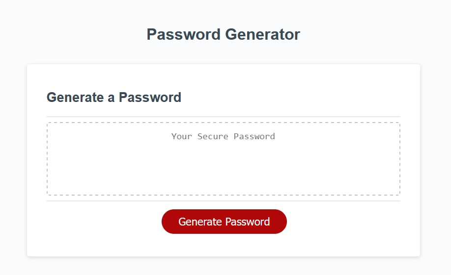

# 03-Challenge Password Generator using JS

## Description

    This is a Password Generator Application using JavaScript. 

## Installation

to deploy repo as website on github (step-by-step) https://everhour.com/blog/how-to-host-website-on-github/ (credit to: Maria Kharlantseva)

## License

refer to LICENSE in repo.

## Credits

    HTML & CSS provide by class work

    source to generator random integer to use for obtaining array index :
    https://developer.mozilla.org/en-US/docs/Web/JavaScript/Reference/Global_Objects/Math/random
    

## Screenshots

    Main page

    Prompt for password length

    Error prompt if password length does not meet requirement

    
    Prompt for each type of password character

    Error prompt if password character selection does not meet requirement

## To-Do's

